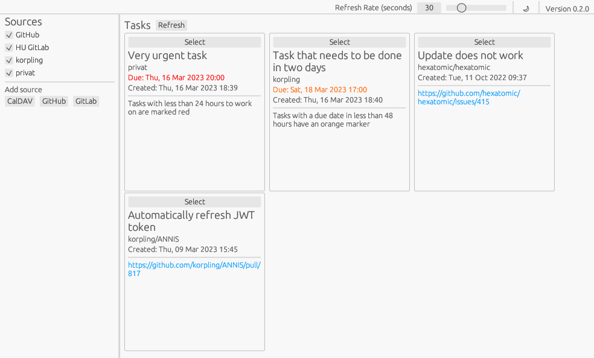

📢 This project has been moved to Codeberg: <https://codeberg.org/thomaskrause/task-picker>

---

#   Task Picker

Task Picker helps you to keep an overview about tasks from different task
trackers, like GitHub or CalDAV. It does not actually manage these tasks itself,
but you can list them and select the one you want to work on. It also needs to
be online to collect the tasks from the sources, there is no local task storage
or cache.

This is a desktop application using the <https://www.egui.rs/> GUI framework.

## Status of the project

This is a personal hobby project and I want to keep the scope of this project
very limited. Feature-wise, this project fulfills my needs, and it is not planned
to add additional options, e.g. for different types of scheduling. If you need a
full-fledged task planner, I can recommend the great [Super
Productivity](https://super-productivity.com/).

Also, there are almost no automatic tests yet and basically testing it means the
features I use are tested manually, but everything else might break easily.
**You should expect breaking changes during updates, e.g. like losing the task
source configuration.** Given more time in the future™ I might add automatic
tests and this would allow more features to be added.

## Sources for tasks

Currently, the following task/issue trackers are supported:

- CalDAV, 
- GitHub,
- GitLab and
- OpenProject

All support due dates, but for GitHub issues have to be part of a milestone with
a due date. GitHub, GitLab and OpenProject issues are only displayed when the
authenticated user is assigned to them.

## Display of tasks

Tasks are sorted by their due date. If no due date is set, the oldest tasks are
listed first. CalDAV tasks that have not started yet are hidden, which can be
used to schedule tasks for later on. If the deadline is only 1 or 2 days away,
the task will be marked by color.

