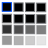

# Task Picker

Task Picker helps you to keep an overview about tasks from different task
trackers, like GitHub or CalDAV. It does not actually manage these tasks itself,
but you can list them and select the one you want to work on. It also needs to
be online to collect the tasks from the sources, there is no local task storage
or cache.

This is a desktop application using the <https://www.egui.rs/> GUI framework.

**Task Picker is currently in development and you should expect breaking
changes during updates.**

## Sources for tasks

Currently, the following task/issue trackers are supported:

- CalDAV, 
- GitHub and 
- GitLab 

All support due dates, but for GitHub issues  have to be part of a milestone
with a due date. GitHub and GitLab issues are only displayed when the
authenticated user is assigned to them.

## Display of tasks

Tasks are sorted by their due date. If no due date is set, the oldest tasks are
listed first. CalDAV tasks that have not started yet are hidden, which can be
used to schedule tasks for later on. If the deadline is only 1 or 2 days away,
the task will be marked by color.

